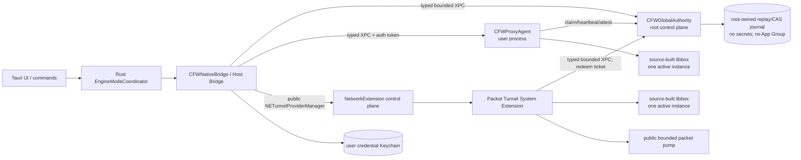
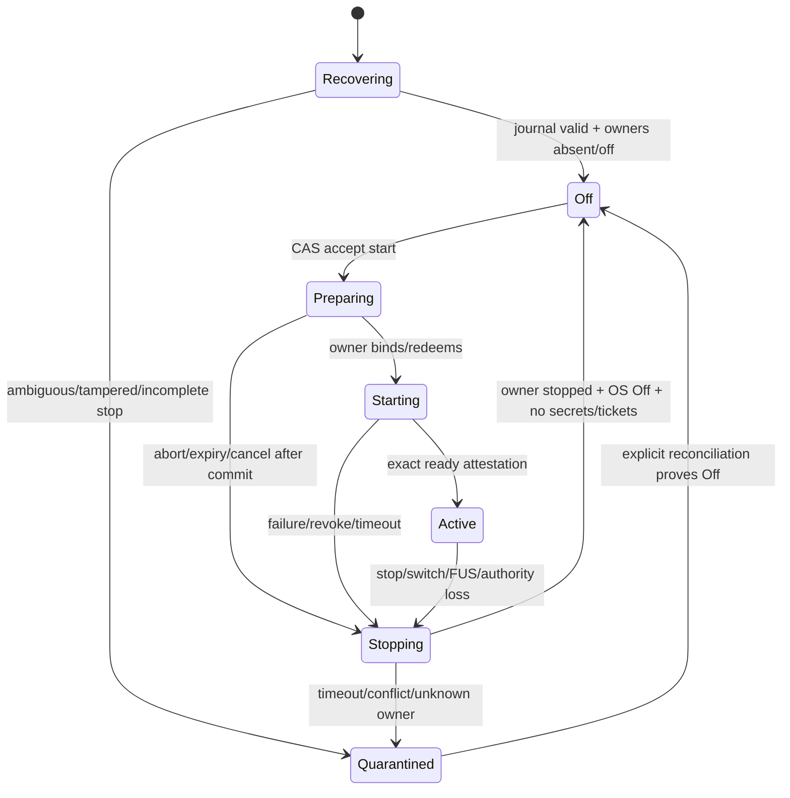

# macOS 15 Network Extension Migration — Design

## Overview

This design targets **macOS 15+ on arm64 only** and replaces the remaining prototype control-plane boundary without reopening any retired data plane. The shipped product is **GPL-3.0-or-later**, builds exactly one libbox from pinned source, and permits exactly one active mode: System Proxy, Tunnel, or Off. Every Proxy↔Tunnel transition passes through a machine-global Off barrier.

### Baseline and P0 correction

Repository inspection establishes the following source baseline:

- source-built libbox, `CFWLibboxRuntime`, `CFWProxyAgent`, the Swift Host Bridge, the Packet Tunnel System Extension, the public bounded packet pump, the Rust coordinator/native bridge, legacy data-plane removal, and the one-way tombstone exist in source;
- the historical statements that libbox/Host Bridge are absent or that the provider fails only because transport was not linked are obsolete;
- `native/macos/Sources/CFWGlobalAuthority` is empty and `native/macos/project.yml` has no Global Authority target;
- the current temporary Tunnel path serializes configuration and ephemeral credentials into `startVPNTunnel(options:)`; the provider independently uses `SandboxConfigurationAcceptanceStore` and `CrossProcessEngineLeaseStore`;
- therefore the current source cannot prove root-context replay protection, cross-Proxy/Tunnel and cross-user arbitration, or the required secret boundary. This missing Global Authority is the P0 blocker.

Existing source is not equivalent to installed-device or release evidence. Each capability is reported using the four evidence levels defined below; no level is inferred from a higher-level-looking status string or a green unbound test run.

### Requirements traceability used by this design

Because this update is constrained to this file, the numbered clauses below refer to the explicit requirements supplied for this design update:

1.1 production fails closed when Global Authority is unavailable or incompatible; 1.2 no root data-plane helper, retired helper, alternate core, or private API fallback exists.
2.1 Global Authority has a documented process/install model and Mach service; 2.2 XPC is typed and bounded; 2.3 every peer is authorized from audit token, Team ID, bundle ID, entitlements, UID, and live console user; 2.4 Fast User Switching is safe; 2.5 one global lease enforces Proxy/Tunnel/multi-user exclusion; 2.6 epoch/generation/replay updates are atomic CAS; 2.7 crash recovery and protocol versioning fail closed; 2.8 secret bytes are memory-only and bounded.
3.1 component and sequence diagrams cover Host/Authority/Provider/ProxyAgent; 3.2 switching uses an Off barrier; 3.3 state/error semantics are explicit; 3.4 save-then-start failure is compensated; 3.5 cancellation and late callbacks cannot revive stale work.
4.1 completion uses four evidence levels and a machine-verifiable manifest.
5.1 platform, license, exclusivity, single-libbox, source-build, toolchain, upstream commit, patches, combined hash, CCS, and SBOM facts are fixed.
6.1 signed installed verification covers lifecycle, multi-user, downgrade, and uninstall; 6.2 real packet evidence covers TCPv4/v6, UDP/QUIC, DNS, LAN, and routes; 6.3 weak-network, performance/resource, 100-switch, and 24-hour soak gates are mandatory; 6.4 identity forgery, replay, tampering, bounds, and backpressure are adversarially tested; 6.5 no required command may skip, mask failure, or use `|| true`.
7.1 interfaces/data models are executable; 7.2 correctness properties and PBT cover pure authority logic; 7.3 migration and recovery return only to Off; 7.4 risks and decisions are recorded; 7.5 source existence is separated from physical evidence.
8.1 an ignored updater-key-named file inside the workspace blocks release; only relocation and, if exposure is plausible, rotation are recorded—its contents are never read.
## Architecture

### ADR-001: A mandatory, narrow Global Authority

**Decision.** Add `CFWGlobalAuthority`, a signed root-context launchd daemon installed and managed only through the public `SMAppService.daemon(plistName:)` API. Its plist is embedded in the signed app at `Contents/Library/LaunchDaemons`, declares the fixed App-Group-prefixed Mach service `YKUPL7Z869.group.com.bill.clashformac.global-authority`, and is signed before the outer app. The shared App Group identifier is used only as the signed Mach-lookup namespace required by the sandboxed System Extension; the Authority and Provider never resolve or share an App Group container. Registration/approval is an explicit install state; absence, denial, version mismatch, or identity mismatch leaves the engine Off.

The Authority is not a revival or fallback of the retired root networking helper. It has no packet, socket-forwarding, libbox, SystemConfiguration mutation, route/DNS mutation, arbitrary file, shell, script, plug-in, or executable-launch interface. It is the mandatory control-plane authority for arbitration, replay state, and one-time Tunnel bootstrap. The old helper identifier and files remain tombstoned. Release code has no branch from an Authority error to the retired helper, direct provider payload path, alternate core, or private Network Extension API.

A root-context process is selected because a user XPC service cannot arbitrate all login sessions, while a user App Group and Data Protection Keychain item do not denote the same storage in root and user contexts. A launchd Mach service installed by documented ServiceManagement API gives one machine-wide rendezvous and audit-token-bearing XPC connections. The Packet Tunnel remains a Network Extension System Extension and continues to use only public `NEPacketTunnelFlow` APIs.

**Production compile-time gate.** Release configuration sets `CFW_GLOBAL_AUTHORITY_REQUIRED=1`. Build-boundary validation rejects a Release product unless the Authority target, launchd plist, designated requirement, protocol module, and embedding/signing entries exist. Release compilation excludes the temporary `TunnelStartPayloadCodec` configuration/credential transport and provider-local acceptance/lease construction. No `CFW_ALLOW_INSECURE_*` symbol or environment override is accepted in Release. A missing Authority returns `globalAuthorityUnavailable` before preference or network mutation.

### Current temporary path versus target path

| Concern | Current temporary source path | Required production path |
|---|---|---|
| Tunnel bootstrap | Host puts configuration and credential payload into `startVPNTunnel(options:)` | Host prepares with Authority; options contain only a bounded, random, single-use start ticket |
| Replay state | provider-owned acceptance store | Authority root-context high-water cursor and CAS journal |
| Exclusivity | provider/ProxyAgent bind a loopback UDP port independently | one Authority lease/state machine across Proxy, Tunnel, and users |
| Secrets | Host → options → provider | Host Keychain → Authority XPC memory → provider XPC memory → immediate libbox injection; never preferences/journal/App Group |
| Cross-user policy | not globally proven | live-console-UID authorization plus forced Off on console-user change |
| Failure | local provider/Host errors | Authority revocation, verified compensation, quarantine until global Off |

The opaque ticket is 32 random bytes, expires after 10 seconds, is stored only as SHA-256 in Authority memory, is single-use, and is bound to operation ID, installation ID, epoch, generation, configuration digest, lease ID, owner UID, and provider bundle. It carries no configuration or secret. `NETunnelProviderProtocol.providerConfiguration` retains only the bounded non-secret descriptor and tunnel network options needed to identify the saved manager.

### Component topology



`LB1` and `LB2` are packaging locations, not concurrent engines: the Authority lease makes the number of running libbox services globally ≤ 1.

### Trust and authorization boundary

The Authority listener rejects a connection before exporting an interface unless all checks pass:

1. obtain the kernel-supplied audit token from the `NSXPCConnection`; derive PID, effective UID, and audit session—never trust caller-supplied identity fields;
2. resolve code with Security.framework using the audit token, validate the exact designated requirement, Team ID `YKUPL7Z869`, and one exact allowed signing identifier;
3. read required entitlements from the resolved code object and compare exact values, not mere key presence;
4. resolve the live console UID using public SystemConfiguration state on every mutating request;
5. apply the role matrix below and bind the immutable `PeerIdentity` to the connection lifetime.

| Role | Signing identifier | UID rule | Required entitlement/purpose |
|---|---|---|---|
| Host | `com.bill.clashformac` | equals live console UID; no `loginwindow`/no-console session | authority-client and expected application groups/Keychain declarations |
| ProxyAgent | `com.bill.clashformac.proxy-agent` | equals lease owner and live console UID | authority-engine-owner plus exact credential access groups |
| Provider | `com.bill.clashformac.packet-tunnel` | root/system-extension context | packet-tunnel-provider-systemextension and authority-engine-owner |

Debug signing, ad-hoc signing, inherited broad requirements, path-only checks, PID reuse, claimed UID, or a same-Team unknown bundle are rejected. Query/snapshot access is also role-scoped; secrets are never returned by snapshot APIs.

### Fast User Switching and global lease

A lease is `{leaseID, operationID, ownerUID, mode, context, configDigest, state, expiresAtMonotonic}`. Only the current console user's authenticated Host can prepare a start. A lock screen that preserves the same console UID does not force a stop. A console UID change, logout to no user, connection invalidation, missed heartbeat, Authority restart ambiguity, or owner identity drift revokes the lease and orders the owner to stop. No new lease is granted until the old owner attests stopped and the OS-facing observer confirms Off. If either proof is unavailable, state is `quarantined`, not Off.

ProxyAgent and Provider maintain a bounded heartbeat and revocation callback channel. They must stop libbox and restore/close owned network state within five seconds after Authority loss or revocation. Authority loss is never interpreted as permission to continue indefinitely. A new user cannot inherit, inspect, resume, or replace another user's lease or prepared secrets.
### Global state machine and Off barrier



The **global Off barrier** is true only when all of these are true for the current Authority revision:

- no active or prepared lease, ticket, owner endpoint, or secret buffer exists;
- ProxyAgent reports listener closed and conflict-aware System Proxy restoration complete, or is proven absent with independent effective SystemConfiguration reconciliation;
- Provider reports libbox stopped and packet pump/socketpair closed, and `NEVPNStatus` is `.disconnected` or `.invalid` for the exact managed descriptor;
- no newer operation/generation is pending and the stop record is durably committed.

A mode switch is `stop current → prove global Off → allocate a fresh generation → prepare target`. Failure never starts the other mode. `Failed`, `Recovering`, and `Quarantined` are not aliases for Off.

### Crash recovery

Authority persists a canonical, versioned, non-secret journal under a root-owned, mode `0700` Application Support directory, opened descriptor-relatively with no symlink following. App Group storage is forbidden. Records use length, sequence, previous-record digest, payload digest, installation ID, epoch, generation, operation ID, and CRC/digest framing; append and head replacement are fsync-ordered. One process lock serializes CAS. The trusted root context is the security boundary; corruption, rollback relative to the durable head, unknown fields, or a broken hash chain quarantines rather than resets.

On restart the Authority:

1. validates the entire bounded journal and protocol schema;
2. reconstructs the high-water replay cursor and last transition;
3. never reconstructs secrets or tickets—they are intentionally lost;
4. enters `Recovering`, rejects starts, and requests exact-generation status from authenticated owner roles;
5. if a prepared/starting operation lost its secret or ticket, orders stop and completes only to Off;
6. if an active owner reattests the exact lease/context/digest within five seconds and live console ownership still matches, it may reconstitute the lease; otherwise it stops and returns only to Off;
7. any disagreement, absent cleanup proof, counter regression, or identity mismatch enters `Quarantined` until an explicit Off reconciliation succeeds.

Owner process crashes invalidate its XPC endpoint. Provider/Agent recovery may restart only under the same unexpired Authority lease, generation, and digest with bounded retry policy; it cannot allocate a generation or self-authorize. Authority crash causes owners to fail closed after the heartbeat grace period.

### Protocol versioning and bounded transport

Wire protocol v1 uses canonical binary property lists or canonical JSON inside `Data`; each envelope is decoded against exact fields before dispatch. The handshake advertises `{major, minor, minimumMinor, featureBits, maxMessageBytes}`. Different major versions, unsupported required features, noncanonical encodings, duplicate fields, unknown command kinds, or excessive sizes fail before state mutation. Minor compatibility is opt-in by feature bit.

Bounds for v1 are: envelope 1 MiB; secret-free configuration 768 KiB; total secret material 256 KiB; 128 credential slots; individual secret 16 KiB; 64 in-flight read-only queries globally; exactly one mutating transaction; 32 queued events per peer; 10-second prepare/ticket TTL; five-second command/stop attestation timeout. XPC interruption has bounded retry only for idempotent queries. Mutations use operation IDs and CAS and are never blindly retried.

Backpressure is explicit: read-only requests exceeding limits receive `resourceExhausted`; mutation contention receives `busy`; event queues coalesce snapshots and never drop revocation/stop commands. No unbounded arrays, base64 secret fields, arbitrary `NSSecureCoding` class sets, file paths, descriptors from untrusted peers, or caller-selected service names are accepted.

## Components and Interfaces

### Executable Swift-facing interfaces

```swift
@objc protocol CFWGlobalAuthorityXPCProtocol {
  func handshake(_ request: Data, reply: @escaping (Data?, NSError?) -> Void)
  func prepareStart(_ request: Data, configuration: Data,
                    secretPayload: Data?, reply: @escaping (Data?, NSError?) -> Void)
  func bindProxyOwner(_ request: Data, reply: @escaping (Data?, NSError?) -> Void)
  func redeemTunnelTicket(_ request: Data,
                          reply: @escaping (Data?, Data?, Data?, NSError?) -> Void)
  func attestReady(_ request: Data, reply: @escaping (Data?, NSError?) -> Void)
  func beginStop(_ request: Data, reply: @escaping (Data?, NSError?) -> Void)
  func attestStopped(_ request: Data, reply: @escaping (Data?, NSError?) -> Void)
  func cancelPrepared(_ request: Data, reply: @escaping (Data?, NSError?) -> Void)
  func snapshot(_ request: Data, reply: @escaping (Data?, NSError?) -> Void)
}
```

Every `Data` argument has a command-specific maximum and exact schema. `prepareStart` accepts secret material only for Tunnel; for Proxy it returns an authorization capability and Host continues using the existing authenticated Host→ProxyAgent credential path. `redeemTunnelTicket` is Provider-only and returns configuration and secret buffers once. Replies are correlated by request and operation IDs.

```swift
protocol AuthorityClient: Sendable {
  func prepare(_ request: PrepareStartRequest,
               configuration: SensitiveBytes,
               secrets: SensitiveBytes?) async throws -> PreparedStart
  func cancelPrepared(_ context: OperationContext, revision: Digest) async throws
  func beginStop(_ request: BeginStopRequest) async throws -> StopDirective
  func snapshot() async throws -> AuthoritySnapshot
}

protocol EngineOwnerAuthorityClient: Sendable {
  func bind(_ capability: OwnerCapability) async throws -> LeaseView
  func redeem(_ ticket: StartTicket) async throws -> RedeemedTunnelStart
  func attestReady(_ attestation: ReadyAttestation) async throws
  func attestStopped(_ attestation: StoppedAttestation) async throws
}
```

`SensitiveBytes` is non-Codable, non-Copying at API boundaries where practical, never printable, and backed by mutable allocated storage. It is zeroized on every success/error/cancel path; best-effort `mlock` is used within a fixed process budget. Authority retains Tunnel secrets only until ticket redemption/expiry (maximum 10 seconds), Provider injects immediately and wipes transport buffers, and libbox teardown destroys its owned instance. Secrets never enter logs, crash annotations, preferences, journal, App Group, evidence, or snapshots.
### Host → Authority → Provider Tunnel start

```mermaid
sequenceDiagram
  participant R as Rust Coordinator
  participant H as Host Bridge
  participant A as Global Authority
  participant N as NETunnelProviderManager
  participant P as Packet Tunnel Provider
  R->>H: startTunnel(request, generation G)
  H->>A: handshake + prepareStart(CAS, config, secrets)
  A->>A: authorize console user; persist high-water; acquire lease
  A-->>H: prepared(ticket, revision, expiry)
  H->>N: save descriptor-only manager preferences
  H->>N: reload and verify exact descriptor
  H->>N: startVPNTunnel(options: ticket only)
  N->>P: startTunnel(ticket)
  P->>A: authenticated redeem(ticket, descriptor)
  A-->>P: one-time config + secrets + lease capability
  P->>P: inject, wipe transport bytes, start libbox/pump
  P->>A: attestReady(G, digest, pump bounds)
  A-->>H: snapshot Active for exact context
  H-->>R: runtime identity
```

Tunnel is Active only when Authority state is Active for the exact lease/context/digest, Provider ready attestation matches, and Network Extension reports connected. An interface or saved manager is not success.

### Host → Authority → ProxyAgent start

```mermaid
sequenceDiagram
  participant R as Rust Coordinator
  participant H as Host Bridge
  participant A as Global Authority
  participant X as ProxyAgent
  R->>H: startSystemProxy(request, generation G)
  H->>A: prepareStart(CAS, descriptor; no Proxy secret)
  A-->>H: proxy owner capability + revision
  H->>X: authenticated start(config reference, capability, ephemeral credentials)
  X->>A: bindProxyOwner(capability, exact audit identity)
  A-->>X: lease confirmed
  X->>X: inject credentials; start one libbox; apply SCPreferences
  X->>A: attestReady(listener + effective proxy state)
  A-->>H: exact Active snapshot
  H-->>R: runtime identity
```

ProxyAgent may not start libbox or apply System Proxy before the Authority validates its owner capability. If Authority cannot be reached, it rejects the request and keeps/restores Off.

### Off-mediated switch and stop

```mermaid
sequenceDiagram
  participant R as Rust Coordinator
  participant H as Host Bridge
  participant A as Global Authority
  participant O as Current Owner
  R->>H: stop exact context
  H->>A: beginStop(lease, generation, digest)
  A->>O: revoke / stop directive
  O->>O: stop libbox; close listener/pump; restore owned OS state
  O->>A: attestStopped(exact context)
  H->>H: verify SC effective state or NEVPN disconnected
  H->>A: OS Off observation
  A->>A: erase ticket/secrets; release lease; commit Off
  A-->>H: Off(revision)
  H-->>R: Off barrier reached
  R->>H: start other mode with fresh generation
```

Stop is idempotent for the same operation and context. A stop for a different generation is `staleOperation`; it cannot stop a newer owner.

### Save succeeded, start failed: compensation

Before mutating `NETunnelProviderManager`, Host records an in-memory `PreferenceMutationReceipt` containing whether the manager was new, the prior bounded protocol configuration/enabled/description values, and the exact descriptor written. After save, any cancellation before start submission, reload mismatch, ticket expiry, synchronous start failure, provider rejection, ready timeout, or Authority revocation invokes this ordered compensation:

1. Authority atomically revokes the ticket/lease and zeroizes retained secret buffers;
2. Host calls `stopVPNTunnel` if status may be connecting/connected and waits boundedly for disconnected/invalid;
3. Host reloads preferences and performs compare-and-restore: only if current values still equal this operation's written values does it restore the prior manager, or remove a manager created by this operation;
4. Host saves, reloads, and verifies the compensation result;
5. Authority commits Off only after Provider/OS Off proof. A comparison conflict or cleanup timeout returns `compensationConflict`/`cleanupUnproven` and leaves `Quarantined`.

Compensation never overwrites user/administrator changes and never starts the previous mode. Preference persistence alone never consumes permission to run; the generation is nevertheless consumed in the replay high-water mark.

### Cancellation and late callbacks

- Before Authority accepts `prepareStart`, cancellation has no side effect.
- After prepare but before preference save, cancellation revokes the prepared transaction and zeroizes secrets.
- After save but before start submission, cancellation runs the compensation above.
- After `startVPNTunnel` or an owner start has been accepted, caller cancellation detaches only that caller's wait. The serialized coordinator continues to exact readiness or compensated Off; dropping a Rust oneshot receiver does not cancel accepted native work.
- System Extension activation has no public withdrawal API. Cancellation ends only the local wait; a later approval/completion callback updates install inventory but cannot start a tunnel.
- Every callback is gated by `{operationID, generation, request identity}` and a one-shot completion gate. A late callback may finish cleanup for its own operation but cannot mutate, mark Active, release, or stop a newer operation.

## Data Models

```text
ProtocolVersion { major: UInt16, minor: UInt16, minimumMinor: UInt16, featureBits: UInt64 }
PeerIdentity { auditTokenDigest, pid, euid, auditSessionID, teamID, signingID,
               designatedRequirementDigest, entitlementDigest, role, consoleUID }
RootContext { installationID: UUID, epoch: UInt64, generation: UInt64 }
OperationContext { operationID: UUID, root: RootContext, mode, configSHA256,
                   identitySHA256, ownerUID, authorityRevision }
GlobalLease { leaseID: UUID, operation: OperationContext, state, issuedMonotonic,
              expiryMonotonic, ownerConnectionNonce }
ReplayCursor { schemaVersion, installationID, acceptedEpoch, acceptedGeneration,
               revision, previousRecordSHA256 }
PreparedStart { operation, leaseID, ticket: SensitiveBytes?, expiresMonotonic,
                preferenceDescriptorSHA256 }
AuthoritySnapshot { protocolVersion, state, revision, replayCursor, leaseView?,
                    lastFailure?, consoleUID? }
ReadyAttestation { operation, leaseID, runtimeDigest, ownerRole, readyFlags,
                   packetPumpLimits?, monotonicTimestamp }
StoppedAttestation { operation, leaseID, libboxStopped, transportClosed,
                     osRestored, monotonicTimestamp }
PreferenceMutationReceipt { operationID, createdManager, priorValues,
                            writtenDescriptorSHA256 }
```

`RootContext` ordering is lexicographic by `(epoch, generation)`. Installation ID is enrolled once into the empty root store by an authenticated console Host and thereafter immutable. Accept requires request installation ID equality, tuple strictly greater than the high-water tuple, expected Authority revision equality, state Off, and no pending operation. The Authority durably advances the cursor before issuing a capability or ticket; aborted generations are never reusable.

The journal contains only state-machine metadata and hashes. `PeerIdentity`, raw audit tokens, tickets, configurations, secrets, and credential references are memory-only except that non-secret descriptor hashes and role/signing requirement digests may be recorded for audit. Bounded diagnostics use stable error codes and redacted fields.
## Correctness Properties

*A property is a characteristic or behavior that should hold true across all valid executions of a system-essentially, a formal statement about what the system should do. Properties serve as the bridge between human-readable specifications and machine-verifiable correctness guarantees.*

Redundancy reflection consolidated overlapping prework items as follows: typed bounds and model round trips are one codec property; Fast User Switching and global exclusion are one lease invariant; adversarial replay/bounds/backpressure are validated by the corresponding authorization, CAS, codec, and lease properties rather than duplicate attack-named properties; evidence classification also covers the prohibition on promoting source existence to physical evidence.

### Property 1: Authority failure is fail-closed

For all Authority handshake, installation, availability, and protocol-compatibility outcomes other than an authenticated compatible success, a requested start emits no libbox start, System Proxy apply, Tunnel start, or fallback action and ends in Off, Failed, or Quarantined.

**Validates: Requirements 1.1, 1.2, 2.7**

### Property 2: Canonical bounded protocol round trip

For all valid v1 authority models within command-specific bounds, canonical encoding followed by decoding produces an equivalent value; for all encodings with an unknown required field/command, noncanonical representation, unsupported version, invalid type, or any exceeded bound, decoding fails before state mutation.

**Validates: Requirements 2.2, 2.7, 6.4, 7.1**

### Property 3: Authorization is exact conjunction

For all generated peer evidence and live console-user states, a role is authorized if and only if audit-token resolution succeeds and every exact role predicate for Team ID, signing identifier, designated requirement, entitlements, effective UID, audit session, and console UID holds; changing any required predicate to a nonmatching value denies the request.

**Validates: Requirements 2.3, 6.4**

### Property 4: Global lease exclusivity and non-transfer

For all interleavings of Host, ProxyAgent, Provider, and multiple-user acquire/start/stop/crash/Fast-User-Switching events, at most one lease and one running libbox owner exist globally, Proxy and Tunnel are never simultaneously active, and a console UID change never transfers a lease or admits the new user before proven Off.

**Validates: Requirements 2.4, 2.5, 3.2, 6.4**

### Property 5: Replay cursor is monotonic CAS

For all Authority revisions, installation IDs, epochs, generations, duplicate requests, and commit reorderings, exactly one request can commit against an expected revision; a commit requires the immutable installation ID and a lexicographically newer `(epoch, generation)`, and the durable high-water cursor never decreases or accepts a consumed tuple again.

**Validates: Requirements 2.6, 6.4**

### Property 6: Recovery never resets permissively

For all bounded valid, truncated, reordered, corrupted, or hash-chain-inconsistent journal inputs and all owner reattestation outcomes, Authority restart reconstructs the exact committed high-water/state or enters Recovering/Quarantined; it never clears replay history, invents a ticket/secret, or grants a start from ambiguous state.

**Validates: Requirements 2.6, 2.7, 7.3**

### Property 7: Secret lifecycle is bounded and terminally erased

For all generated secret payloads and every success, rejection, cancellation, timeout, ticket expiry, XPC interruption, and owner crash path, out-of-bound material is rejected before retention and every Authority/transport-owned in-bound buffer is erased by its terminal path without appearing in any serializable snapshot or journal model.

**Validates: Requirements 2.8, 6.4**

### Property 8: Off precedes every cross-mode start

For all generated mode-command traces, any transition from Proxy to Tunnel or Tunnel to Proxy contains a completed global Off barrier between the old owner's stop and the new owner's prepare/start, and failure to prove any Off predicate emits no target-mode start action.

**Validates: Requirements 3.2, 7.3**

### Property 9: Preference compensation preserves external changes

For all prior manager states, save-success failure points, and concurrent external preference edits, compensation restores/removes only values that still equal the failed operation's exact write, never overwrites differing external values, and terminates in verified Off or Quarantined rather than Active or the previous mode.

**Validates: Requirements 3.4, 7.3**

### Property 10: Cancellation and callbacks are generation-isolated

For all permutations of cancellation, timeout, OS callback, owner callback, and newer-operation events, each operation completes at most once; a stale/late event cannot mark Active, release, stop, or otherwise mutate a newer generation, while accepted work continues to exact readiness or compensated Off.

**Validates: Requirements 3.5, 6.4**

### Property 11: Evidence levels cannot be promoted without closure

For all evidence manifests, a capability is accepted at a level only if every required predecessor, exact artifact/environment binding, digest, command result, and level-specific evidence is present and valid; source or unsigned evidence alone can never satisfy signed-installed or sealed-release status, and any skipped/masked/unbound item rejects the manifest.

**Validates: Requirements 4.1, 6.5, 7.5**

### Property 12: Migration failures never revive a retired path

For all recognized temporary/legacy starting states and all migration failure points, the migration reducer emits only no-op inspection, stop, cleanup, Authority enrollment, or quarantine actions and ends in Off or Quarantined; it never starts the old helper, temporary direct-payload Tunnel path, previous mode, or alternate core.

**Validates: Requirements 1.2, 7.3**
## Evidence and Completion Model

### Four levels

Each capability has exactly one highest achieved level; `null` means not yet achieved. Levels are monotonic but non-substitutable:

1. **source implemented** — reviewed source, target/build graph, static boundary checks, and source hashes exist;
2. **unsigned CI verified** — level 1 plus exact unsigned artifacts and passing deterministic unit/PBT/analyze reports bound to the same commit/toolchain;
3. **signed installed verified** — level 2 plus exact signed app tree, nested identities/entitlements/provisioning, and required physical-machine installed/runtime evidence bound to that app manifest;
4. **sealed release evidence** — level 3 plus accepted notarization, staple and Gatekeeper proof, final artifact hashes, GPL complete corresponding source (CCS), modification notices, reviewed licenses, SPDX and CycloneDX SBOMs, and an immutable outer manifest.

A source checkbox cannot claim level 2; CI cannot claim level 3; a locally signed or installed build cannot claim level 4. Every verifier must fail on missing, skipped, stale, redacted-without-hash, or artifact-unbound evidence; no probe may convert unavailable, timeout, malformed output, or nonzero exit into success.


### Current completion by evidence level

| Capability | Source implemented | Unsigned CI verified | Signed installed verified | Sealed release evidence |
|---|---:|---:|---:|---:|
| Native targets, source-built libbox linkage, ProxyAgent, Host Bridge, Packet Tunnel, public bounded packet pump | yes | not credited without an exact current CI manifest | not yet proven | not yet sealed |
| Rust application/engine/config/apple bridge and Tauri wiring | yes | not credited without an exact current CI manifest | not yet proven | not yet sealed |
| Retired runtime/helper removal, deletion boundaries, and one-way tombstone | yes | static gates exist; exact candidate report still required | cleanup/uninstall proof pending | pending |
| Global Authority target, daemon, authenticated XPC, root replay CAS, multi-user arbitration | **no — P0** | no | no | no |
| Production removal of direct Tunnel payload and provider-local lease/acceptance authority | **no — P0** | no | no | no |
| Signed packet correctness/performance/stability matrix | source probes/targets only | deterministic test coverage does not satisfy this row | pending physical evidence | pending |
| GPL CCS, patch closure, reviewed licenses, merged SPDX/CycloneDX SBOM, notarized artifact manifest | scripts/pins partially present | partial and not sufficient | pending exact signed bundle | pending; current publication closure is not accepted |

The repository is therefore **source-advanced but release-blocked**. Most migration mechanics are level 1; Global Authority is below level 1; no level 3 or 4 claim is made by this design.

### Recovery sequence

```mermaid
sequenceDiagram
  participant O as Owner (ProxyAgent/Provider)
  participant A as Restarted Authority
  participant H as Host Observer
  A->>A: validate bounded journal and durable replay head
  A->>A: enter Recovering; erase/not reconstruct tickets or secrets
  A->>O: request exact lease/generation/digest attestation
  O-->>A: ready or stopped attestation (authenticated)
  H-->>A: exact SCPreferences or NEVPNStatus observation
  alt identity, console UID, lease, digest, and observations agree
    A->>A: reconstitute same active lease or commit Off
  else absent, stale, corrupt, timeout, or disagreement
    A->>O: revoke and order stop
    A->>A: Quarantined until owner-stopped + OS-Off proofs
  end
```

Network Extension lifecycle is not daemon-like: launch, termination, sleep/wake, path changes, and provider restart are controlled by the OS. The Authority never assumes the Provider is continuously resident and never treats XPC disconnect alone as proof of stop. Conversely, a Provider launch without a redeemable Authority ticket cannot reconstruct configuration or credentials and must fail startup.

## Rust and Swift Contract Evolution

The public Rust product commands remain unchanged: `EngineBackend::{query_status,start_system_proxy,stop_system_proxy,install_tunnel,cancel_tunnel_install,start_tunnel,stop_tunnel}` and the corresponding `NativeBridgeCommand` variants remain the only Tauri-facing control contract. Global Authority is a native implementation detail below `CFWNativeBridge`; no UI command may acquire a lease or submit raw Authority envelopes.

The target Rust error taxonomy extends `BackendErrorKind` with exact non-secret variants:

```rust
GlobalAuthorityUnavailable,
GlobalAuthorityIdentityRejected,
GlobalAuthorityProtocolMismatch,
GlobalLeaseConflict,
ReplayRejected,
StaleOperation,
CompensationConflict,
CleanupUnproven,
Quarantined,
```

Swift maps only stable codes to these variants. It never forwards localized OS/XPC text as policy input. `PermissionDenied` remains user/OS permission failure; `IdentityRejected` remains ProxyAgent/Provider peer rejection; the new Authority cases distinguish the machine-global boundary. `Quarantined` is non-retryable until reconciliation; `Busy` and `GlobalLeaseConflict` may be retried only after a fresh snapshot; replay and stale-operation errors are never retried with the same context.

The target Swift interfaces are the `CFWGlobalAuthorityXPCProtocol`, `AuthorityClient`, and `EngineOwnerAuthorityClient` contracts above, plus these exact Host abstractions:

```swift
protocol GlobalAuthorityServiceControlling: Sendable {
  func registrationStatus() -> AuthorityRegistrationStatus
  func register() throws
}

protocol ManagedTunnelPreferences: Sendable {
  func stage(_ descriptor: ConfigurationDescriptor) async throws -> PreferenceMutationReceipt
  func start(ticket: StartTicket) throws
  func compensate(_ receipt: PreferenceMutationReceipt) async throws
  func observedStatus(for descriptor: ConfigurationDescriptor) async throws -> NEVPNStatus
}
```

Release `start(ticket:)` accepts only the opaque ticket. `configuration`, `credentialPayload`, `TunnelStartPayloadCodec`, `SandboxConfigurationAcceptanceStore`, and `CrossProcessEngineLeaseStore` are excluded from production Provider startup. The latter lease may remain only in explicitly named test fixtures; it is not a defense-in-depth production authority because it cannot prove owner identity, lineage, or FUS policy.

### State invariants

1. `runningLibboxOwners.count <= 1` machine-wide.
2. `ProxyActive` and `TunnelActive` are mutually exclusive, and opposite-mode starts require a newer generation after committed global Off.
3. Authority `revision` and replay `(epoch,generation)` never decrease; consumed tuples are never reusable, including aborted starts.
4. Active implies exact agreement among Authority lease/context/digest, owner ready attestation, and OS effective state.
5. Off implies no lease/ticket/secret/owner endpoint and proven owner plus OS cleanup; unknown is Quarantined, never Off.
6. Only an authenticated live-console Host may prepare; only the exact signed owner role may bind/redeem; leases are not transferable across UID or connection nonce.
7. No secret-bearing type is `Codable`, logged, journaled, placed in preferences/App Group, returned by snapshot, or included in evidence.
8. Cancellation and callbacks are scoped by operation ID and generation and complete at most once.
9. Preference compensation is ownership-sensitive: compare-and-restore may alter only the exact values written by that operation.
10. Release code has no transition from Authority failure to direct options payload, old helper, external core, or private packet-flow API.

## Error Handling

| Error class | Required response | Retry rule |
|---|---|---|
| Authority absent/unregistered/denied | no preference or network mutation; report unavailable; remain Off | only after explicit registration/status change |
| Peer identity/entitlement/console-user mismatch | invalidate XPC connection, redact diagnostics, revoke affected preparation | no automatic retry |
| Protocol/version/feature mismatch or malformed/oversize message | reject before dispatch or allocation beyond bound | only after compatible software update |
| Lease conflict/FUS | reject new start; revoke old owner on UID change; prove Off | fresh snapshot after Off only |
| Replay/stale generation/CAS conflict | reject without consuming another state mutation | caller must allocate/reconcile a fresh context |
| Ticket expiry/duplicate redemption | erase retained secret, stop/compensate, quarantine if cleanup is unproved | fresh generation only |
| Owner or Authority crash/XPC interruption | fail closed; bounded reattestation, otherwise stop to Off/quarantine | never blind-retry mutation |
| `NETunnelProviderManager` save/reload/start/ready failure | execute compare-and-restore compensation and exact OS/owner cleanup | fresh generation after verified Off |
| Stop timeout, external preference conflict, ambiguous OS state | preserve evidence and enter Quarantined | manual/explicit reconciliation only |
| Journal corruption/rollback/hash-chain failure | reject starts; retain root-owned artifact for diagnosis; Quarantined | no reset-to-empty recovery |

Diagnostics include stable code, operation ID, generation, role, and redacted digest prefixes only. They exclude configuration, credential references where linkability is unnecessary, audit token bytes, tickets, and secrets.

## Implementation Slices

1. **Release fail-closed gate:** add `CFW_GLOBAL_AUTHORITY_REQUIRED`, block release start before mutation, and make the insecure Tunnel payload path development-only. Add static bundle/source gates rejecting old helper, external core, private KVC/file-descriptor access, and insecure symbols.
2. **Protocol and pure model:** add bounded v1 models/codecs, role authorization predicate, lease/replay reducer, canonical journal model, error mappings, and shared Rust/Swift fixtures. Pin `SwiftCheck` 0.12.0 for native PBT after license/toolchain admission.
3. **Authority product:** add the root daemon target, embedded launchd plist, `SMAppService.daemon` controller, fixed App-Group-prefixed Mach service, root-owned descriptor-relative journal, code identity checks, FUS observer, and recovery/quarantine state machine.
4. **Owner integration:** make ProxyAgent claim/heartbeat/attest through Authority; make Provider redeem a one-use ticket and remove its production local acceptance/lease authority. Add the App Group entitlement to Provider only for Mach lookup; add no shared-container reads/writes.
5. **Host transaction:** prepare with Authority before preferences, save/reload/verify, start with ticket only, await triple agreement, and implement compare-and-restore compensation for every post-save exit including cancellation and late callbacks.
6. **Rust/Tauri integration:** retain existing commands, map new typed errors/states, enforce accepted-work cancellation semantics, and surface registration/quarantine without exposing raw Authority operations.
7. **Migration and cleanup:** stop any temporary direct-payload runtime, prove Off, reconcile the saved manager, enroll immutable installation lineage into empty root state, and delete/compile out production insecure transport. Never import secret bytes or treat provider-local cursor as authoritative.
8. **Evidence closure:** run unsigned tests, sign/install matrices, adversarial tests, packet/performance/soak gates, then produce the sealed manifest, CCS, notices, hashes, and merged SBOMs.

Each slice lands fail closed and is independently reviewable. Slices 2–6 do not enable production starts until slices 1–7 and signed installed gates all pass.

## Migration and Rollback

Upgrade begins with read-only inventory. If a Proxy or Tunnel from the temporary path is active or ambiguous, the new build stops it and proves the global Off barrier before Authority enrollment. Enrollment accepts one immutable installation ID and a high-water epoch/generation only when the host Keychain lineage, managed non-secret descriptor, and signed Host identity agree; disagreement quarantines. Local provider acceptance data may inform diagnostics but cannot lower or establish the root cursor. No credential or configuration payload is migrated into root persistence.

A failed migration, downgrade attempt, Authority uninstall, daemon approval denial, or incompatible version may transition only to **Off** or **Quarantined**. “Rollback” means disabling/stopping the new engine and restoring only product-owned OS state. It never means starting the previous direct-payload Tunnel, old root helper/runtime, previous Proxy/Tunnel mode, external core, or private API. Older binaries that do not require Authority are blocked by downgrade policy and cannot consume the new lineage.

## Release Gates and Evidence Manifest

The release gate consumes one canonical manifest bound to commit, toolchain, source tree, patched libbox tree, unsigned artifacts, exact signed app tree, machine/OS, test reports, and publication set. At minimum it records:

```text
EvidenceManifestV1 {
  product/version/commit, macos_min=15.0, arch=arm64, license,
  toolchain_digests, sing_box_upstream_commit, patch_digests[3], combined_diff_sha256,
  source_tree_sha256, libbox_xcframework_sha256, signed_app_tree_sha256,
  nested_code[{path,bundle_id,team_id,cdhash,entitlements,provisioning}],
  capabilities[{id,highest_level,report_hashes}],
  installed_runs[{machine_id_hash,os_build,console_user_case,report_hashes}],
  packet_captures[], performance_reports[], security_reports[], soak_report,
  notarization, staple, gatekeeper, ccs, modification_notice,
  spdx_sbom, cyclonedx_sbom, third_party_notices, artifact_hash_manifest
}
```

The validator rejects duplicate keys, unknown required schema versions, absent raw report hashes, timestamp-only claims, mismatched CDHashes, stale reports, skipped probes, masked command failures, or any capability promoted past its closure. All reports are immutable and content-addressed; secrets and raw usernames are excluded.

### Fixed toolchain and supply-chain facts

- Go `1.26.5`; sing-box `v1.13.14` at commit `25a600db24f7680ad9806ce5427bd0ab8afe1114`.
- Patches are `sing-box-v1.13.14-security-dependencies.patch` (`ca751c4ec4b82a60d4dd8716627dc2665b154901a988603108bb5e4e718cf439`), `sing-box-v1.13.14-raw-packet-tun.patch` (`5e578e7f3695116f8e1dfbb3fc7c2fc276c9b8c193428e5fd6fa71dc57fb8d60`), and `sing-box-v1.13.14-dns-failover.patch` (`d52fc83c28b5baa919a4d1590a90f7353daaa3120b6ac39aa8e4476133c602d3`).
- The authoritative combined diff SHA-256 is `f3d84e99e7832495975e4d78fd73744f63c1d0f79393b7276cce2f6e3e80c233`. A per-patch or legacy single-patch digest cannot substitute for it.
- Release must bind upstream source, all patches, patched Go module hashes, XCFramework, GPL-3.0-or-later complete corresponding source, modification notice, third-party notices, vulnerability reports, and merged SPDX plus CycloneDX SBOMs to the signed app.
- The ignored workspace updater-key path is identified by path/name only and **must not be opened or read**. Its presence blocks release until moved to an external controlled store; if backup/archive exposure is plausible, rotate it and publish the trust migration.

## Testing Strategy

### Unit and property tests

Use example-based XCTest/Swift Testing for exact OS error mappings, registration states, manager save/reload fixtures, callback gates, and every domain error. Use `SwiftCheck` for pure Swift Authority codecs, authorization, lease/replay reducer, journal recovery, compensation reducer, secret-buffer instrumentation, and evidence validator. Each design property has exactly one PBT, runs at least 100 successful generated cases (higher for codec/parser tests), prints reproducible seed and shrunk counterexample, and carries:

`Feature: macos15-network-extension-migration, Property N: <property title>`

Cross-language canonical fixtures are decoded and re-encoded by Rust and Swift. PBT never calls real launchd, Keychain, Network Extension, or XPC 100 times; those boundaries use examples/integration tests. Fault injection covers every durable-write boundary and every cancellation/late-callback position.

### Unsigned CI

Required lanes are Rust fmt/clippy/test/deny, pinned Node install/build/audit, Swift package tests, Xcode unsigned tests/analyze for Host Bridge, ProxyAgent, Packet Tunnel, and Authority, source/build-boundary scans, patch/hash verification, protocol fixture compatibility, and manifest-validator negative tests. A probe missing its tool, fixture, artifact, permission, or expected output fails the lane; scripts may not use `|| true`, unconditional skip, swallowed exit status, or “not available = pass”.

### Signed installed and physical-machine matrix

On clean Apple Silicon macOS 15 and current macOS, verify inside-out signing, exact Team ID/bundle IDs/entitlements/provisioning, daemon registration/approval/denial, System Extension approval/pending/restart/upgrade/replacement/downgrade refusal, install/uninstall cleanup, login/logout/lock/Fast User Switching with at least two users, concurrent starts, Authority/Host/ProxyAgent/Provider crashes, sleep/wake, and reboot recovery.

Every packet case uses a unique token and real packet capture or independent server observation: TCPv4, TCPv6, UDP, QUIC, DNS A/AAAA through both failover roles, LAN bypass, included routes, excluded routes, stop cleanup, and IPv6-disabled absence. `NEVPNStatus`, `utun` presence, localhost control traffic, or provider logs alone are not packet proof.

Run weak-network profiles of 100 ms/1%/10 Mbps, 300 ms/5%/1 Mbps, and a 30-second outage. Enforce recovery p95 ≤10 s, connect p95 ≤5 s, disconnect p95 ≤3 s, throughput ≥90% of same-machine libbox baseline, added latency ≤10%, idle CPU <1%, RSS ≤120 MiB, 100 switches with RSS growth ≤5 MiB and FD growth ≤2, and a 24-hour zero-crash soak. Capture raw p50/p95/p99 samples, CPU/RSS/FD, queue admission/drop, machine/OS/power/network parameters, and exact build identities.

Security tests use separately signed allowed and denied clients to exercise wrong Team, bundle, entitlement, UID/session, stale PID/audit evidence, inactive console user, same-Team unknown bundle, replayed operation/ticket, duplicate redemption, cursor rollback, journal truncation/tamper/symlink, oversize/deep/noncanonical messages, request floods, in-flight/event-queue saturation, heartbeat loss, FUS races, and attempted secret extraction from logs/preferences/journal/crash/evidence. A failed or unavailable attack probe blocks publication.

## Research Findings and Design Rationale

Repository inspection is authoritative for current implementation status: `project.yml`, `Package.swift`, Host Bridge, Packet Tunnel Provider, Rust engine/native bridge, dependency pins, release gates, and performance targets were checked. Empty `Sources/CFWGlobalAuthority` and absent Authority package/Xcode targets confirm the P0 gap; `.build` remnants are not source evidence.

Apple’s Network Extension packaging guidance distinguishes global system extensions from per-user app extensions and warns that user-context sharing assumptions do not cross that boundary ([Network Extension Provider Packaging](https://developer.apple.com/forums/thread/800887)). Apple guidance also states that shared containers work only for processes running as the same user ([Sharing Core Data between Network Extensions](https://developer.apple.com/forums/thread/710892)). This supports a root global authority and forbids cross-user App Group storage. The design uses documented ServiceManagement registration ([SMAppService](https://developer.apple.com/documentation/servicemanagement/smappservice)), public Network Extension APIs, and code-signing requirements on XPC peers; no KVC or private descriptor extraction is permitted. Content from linked guidance was rephrased for compliance with licensing restrictions.

## Deferred Documentation Synchronization

This change intentionally modifies only this spec design. After implementation, update repository documents that still claim libbox is unlinked, the Rust→Swift Host Bridge is absent, the public packet contract is unavailable, or the Provider always returns `systemExtensionStateTransportNotLinked`. At minimum review `docs/network-extension-spike.md`, `docs/parity-checklist.md`, and the obsolete release-blocking wording in `RELEASE.md`. Replace those conclusions with the verified current baseline and retain Global Authority plus signed evidence as the blocker. Do not mark those files complete until their claims are bound to the relevant evidence level.
